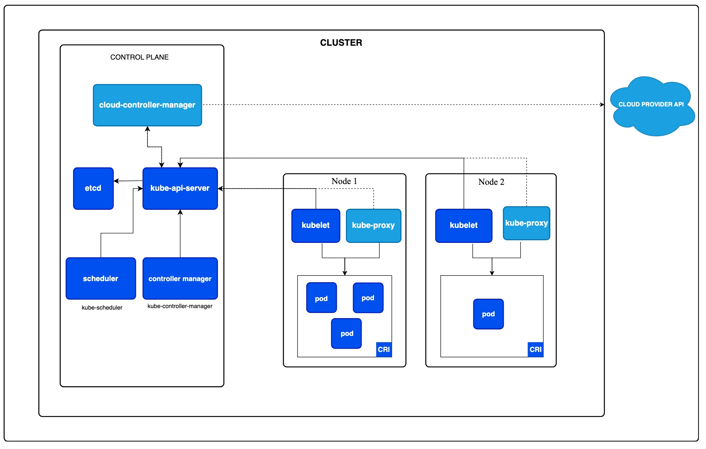

# Kubernetes Architecture: A Deep Dive

---

## Overview

Kubernetes operates on two types of nodes:
- **Master Node:** The control plane that manages the cluster
- **Worker Node:** The data plane that runs the actual workloads

> **Best Practice:** Always run at least **two worker nodes** to ensure high availability. If a single node fails, your application remains running on the other node.

---

## Architecture Diagram

---

## Master Node (Control Plane)

The Master Node is responsible for:
- **Monitoring and managing** the cluster state
- **Re-scheduling/restarting** failed pods
- **Deciding** where and how to join a new pod

> **Best Practice:** It is wise to have **multiple Master Nodes** for High Availability (HA).

The Master Node runs **4 core processes**:

---

### 1. API Server
- Acts as the **gateway** for the entire cluster
- **Authenticates and validates** all incoming requests
- The single entry point for all cluster operations (kubectl, UI, API)
- All other components communicate through the API Server

---

### 2. Scheduler
- Responsible for **scheduling new pods** onto appropriate nodes
- Intelligently evaluates multiple parameters before scheduling:
  - Available CPU and memory
  - Node affinity rules
  - Resource requests and limits
- Sends the scheduling request to the **Kubelet** on the selected node to start the pod

---

### 3. Controller Manager
- Monitors **actual state vs. desired state** of the cluster
- Responds when pods, nodes, or endpoints go down
- When a pod dies, it sends a request to the Scheduler to reschedule it, which then forwards the request to Kubelet to start it

#### Key Controllers:

| Controller | Responsibility |
|------------|---------------|
| **Node Controller** | Monitors nodes and responds when a node comes up or goes down, ensuring the Scheduler can place pods based on node availability |
| **Endpoint Controller** | Joins Services and Pods by creating endpoint records in the API |
| **Replication Controller** | Ensures the desired number of pod replicas are always running for high availability |

---

### 4. etcd (Cluster Brain)
- Acts as the **cluster brain** — all other processes (API Server, Scheduler, Controller Manager) depend on it
- Stores **all cluster state changes** in a distributed key-value store
- The single source of truth for the entire cluster configuration

---

## Worker Node

Every Worker Node runs **5 core components**:

---

### 1. Kubelet
- The **primary node agent** running on each node
- Monitors that containers are running and healthy
- Interacts with both the **container runtime** and the **node**
- Starts pods with containers and assigns resources (CPU, memory) from the node
- Establishes communication between nodes in the cluster
- **Must be installed on every worker node**, along with a container runtime (e.g., Docker)

---

### 2. Kube Proxy
- Maintains and updates **Service IP and Pod IP** in IP tables
- Forwards requests from Services to Pods with **low network overhead**
- Uses intelligent technology to avoid unnecessary network hops
- IP tables are stored in the **kernel** of the Worker Node
- **Must be installed on every node**

---

### 3. Pod
- The **smallest deployable unit** in Kubernetes
- Can be **created, deployed, or destroyed**
- Usually runs a **single container**, but can contain tightly coupled containers
- Shares network and storage resources among its containers

---

### 4. Container Runtime
- A **daemon process** that manages the lifecycle of containers on physical or virtual hosts
- Creates, starts, stops, and destroys containers
- Kubernetes uses **containerd** as its default container runtime

#### Popular Container Runtimes:

| Runtime | Description |
|---------|-------------|
| **containerd** | Default Kubernetes runtime, lightweight and production-grade |
| **Docker** | Popular, lightweight runtime with vast community support |
| **rkt (Rocket)** | Runs in daemonless mode; each container process has its own PID, allowing restarts of individual processes without killing the entire container |

---

### 5. Container Registry
- Allows developers to **store and retrieve** container images
- Used to pull images when deploying pods

#### Popular Container Registries:

| Provider | Registry |
|----------|----------|
| **Docker** | Docker Hub |
| **Google** | Google Container Registry (GCR) |
| **Azure** | Azure Container Registry (ACR) |
| **AWS** | Elastic Container Registry (ECR) |

---

## Best Practices

### Master Node Best Practices

| # | Best Practice | Description |
|---|--------------|-------------|
| 1 | **High Availability** | Always run multiple master nodes to avoid single points of failure |
| 2 | **Quorum Maintenance** | etcd requires a quorum (majority) to function correctly. Use the formula: `Q = (N/2) + 1` |
| 3 | **Spread Across AZs** | Distribute master nodes across multiple Availability Zones |
| 4 | **Load Balancer** | Place a Load Balancer in front of API servers |
| 5 | **No Workloads** | Never run application workloads on master nodes |

#### Quorum Reference Table

| Master Nodes | Quorum Required | Fault Tolerance | Recommended |
|:------------:|:---------------:|:---------------:|:-----------:|
| 1 | 1 | 0 | ❌ Dev only |
| 2 | 2 | 0 | ❌ No benefit |
| 3 | 2 | 1 | ✅ Minimum HA |
| 4 | 3 | 1 | ❌ Same as 3 |
| 5 | 3 | 2 | ✅ Production |
| 6 | 4 | 2 | ❌ Same as 5 |
| 7 | 4 | 3 | ✅ Large clusters |

> **Formula:** `Q = (N/2) + 1`  
> For example, with 5 nodes: `Q = (5/2) + 1 = 3.5 → 3` (minimum quorum required)

---

### Worker Node Best Practices

| # | Best Practice |
|---|--------------|
| ✅ | **Label nodes** by workload, environment, and availability zone |
| ✅ | **Set resource requests & limits** on all pods |
| ✅ | **Configure autoscaling** to handle dynamic workloads |
| ✅ | **Spread nodes** across multiple Availability Zones |
| ✅ | **Regular OS patching** to maintain security and stability |
